# 01 Presentación del curso 02:26 min

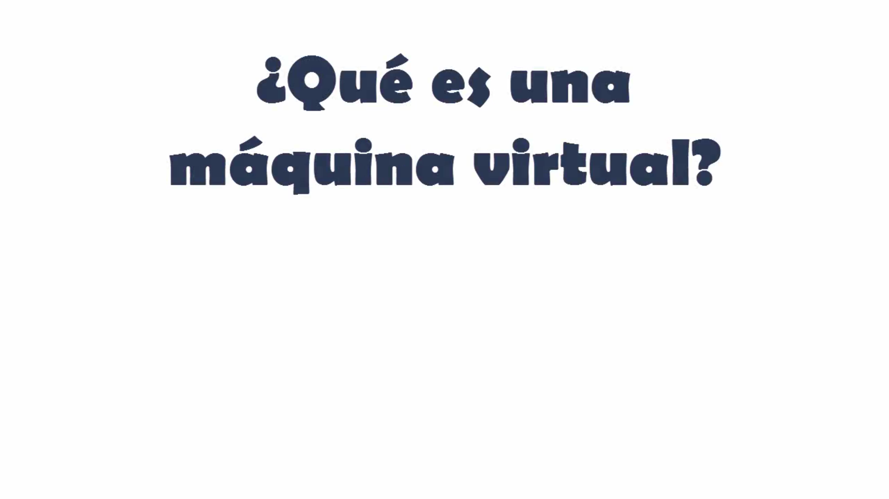

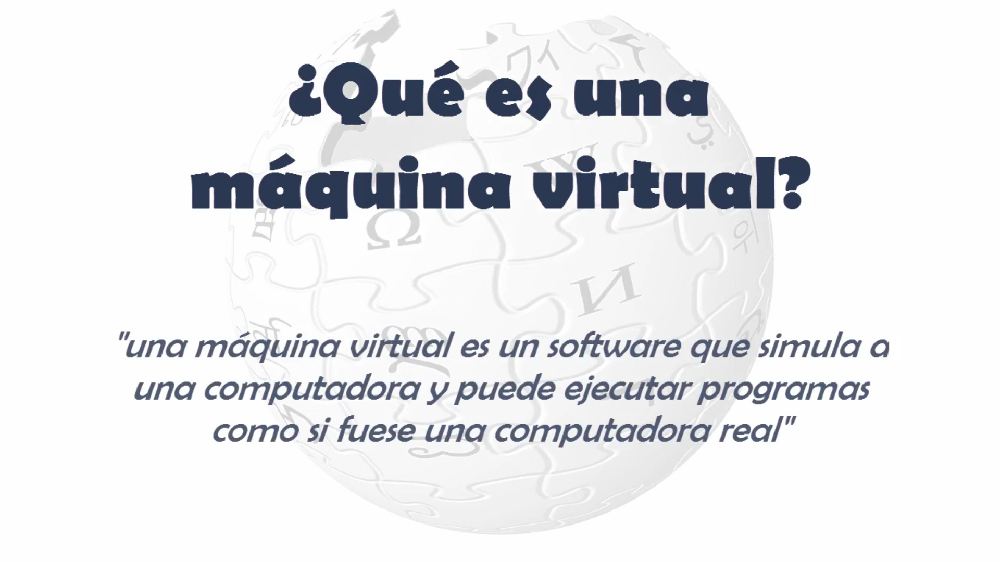

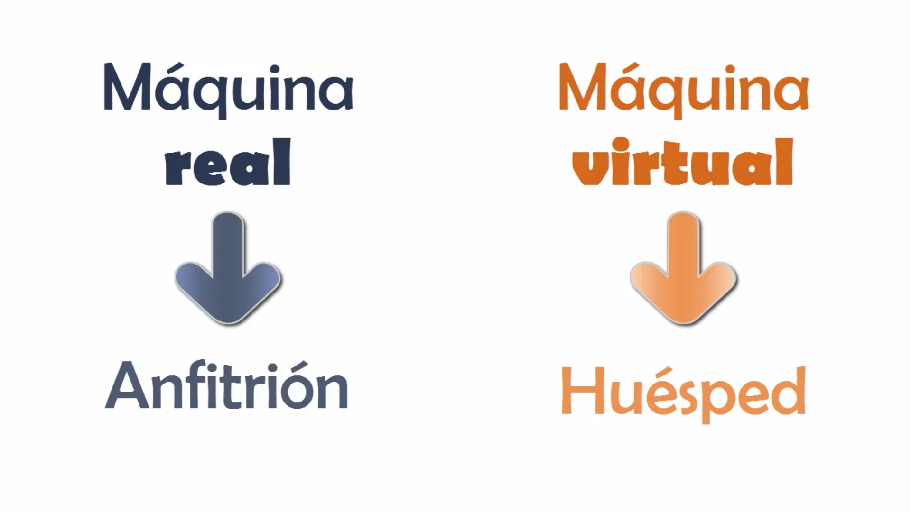

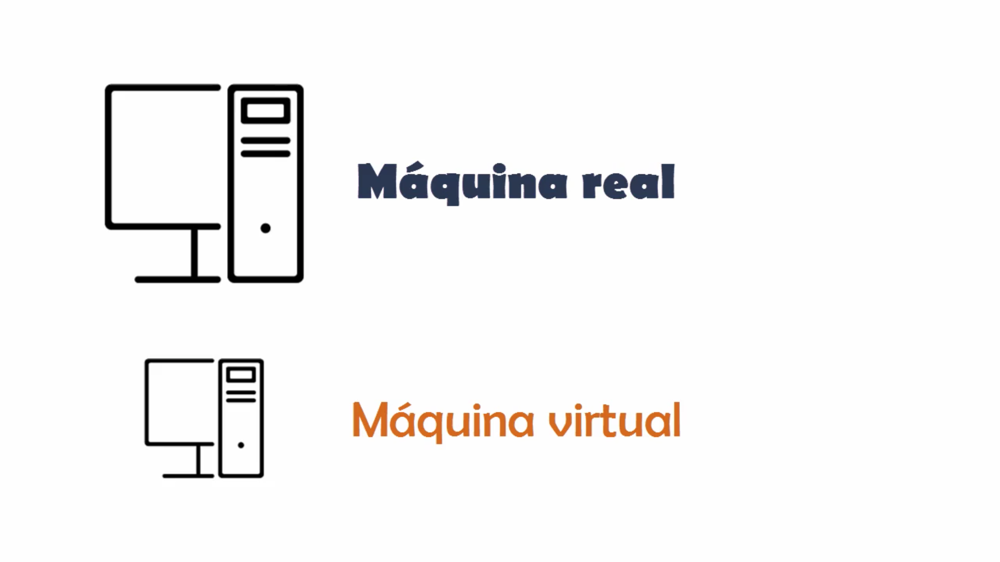

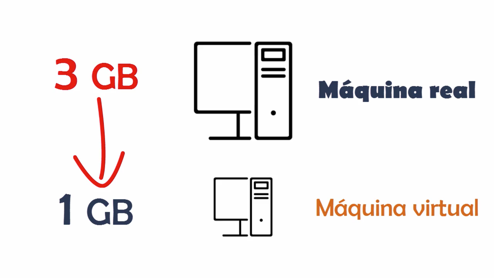

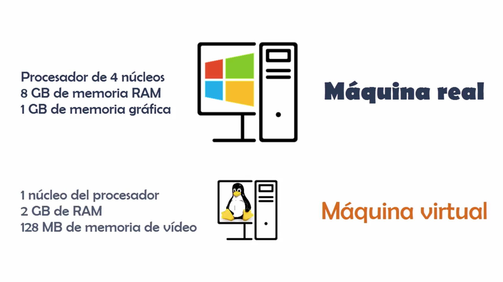

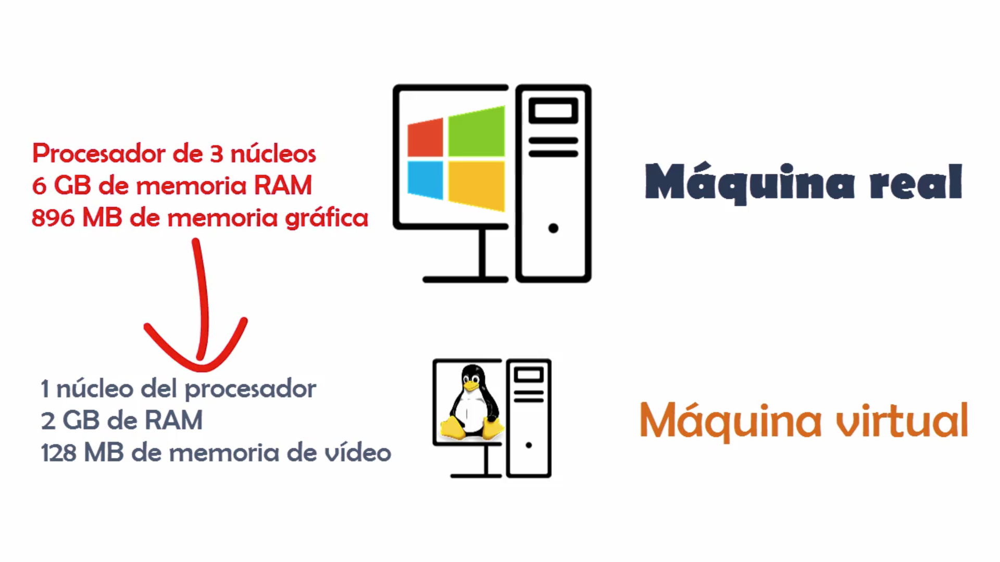

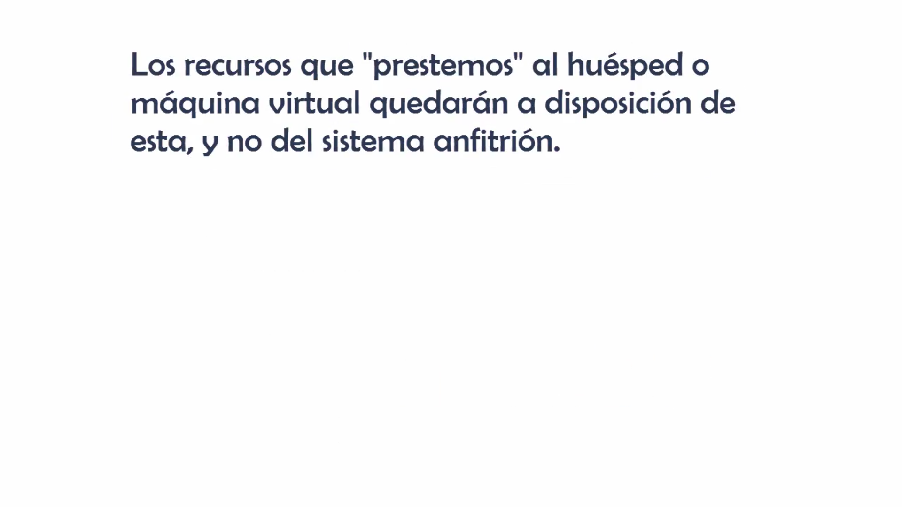

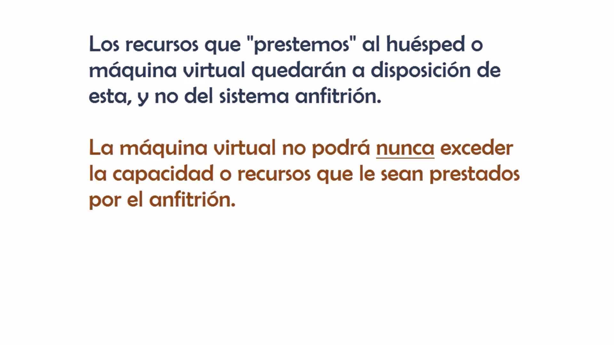

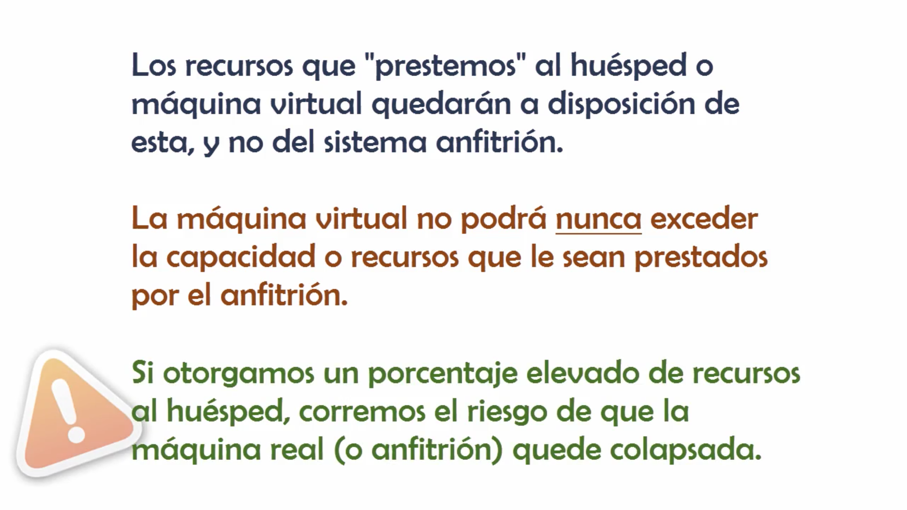

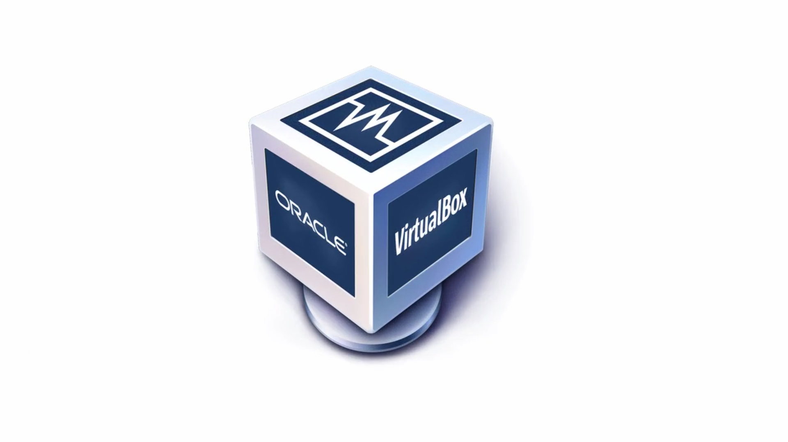

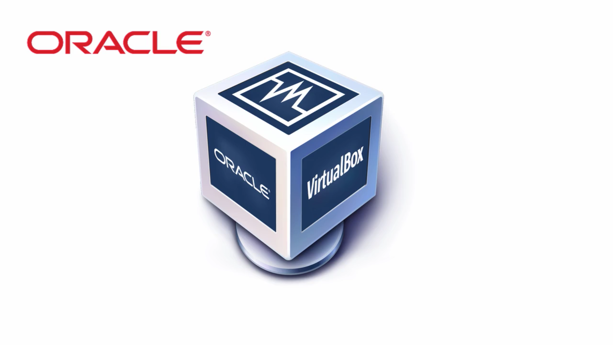

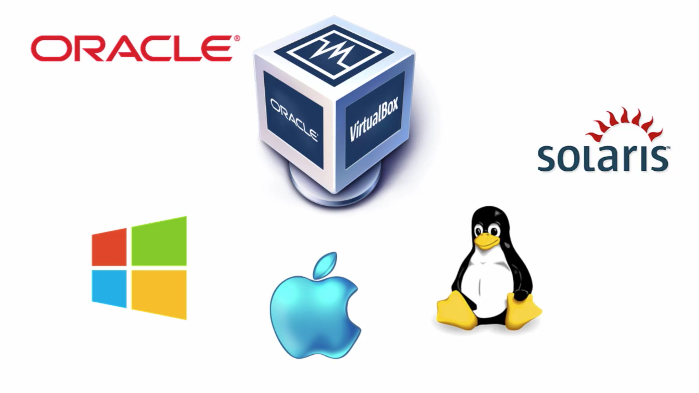

Hola bienvenido al curso de VirtualBox mi nombre es David Gutiérrez soy programador y desarrollador web además de formador en informática yo soy la persona que te acompañara durante este curso todo lo que debes saber sobre esta potente aplicación que es VirtualBox qué es una máquina virtual las ventajas e inconvenientes del uso de estas así como a crearlas y configurarlas todo enfocado al caso particular de VirtualBox como entorno de virtualización para hacerlo más didáctico del curso contará con infinidad de ejemplos prácticos veremos cómo instalar las máquinas virtuales más comunes aprenderemos a configurar las máquinas de forma de alzada y veremos el caso práctico de un desarrollador que trabajen Windows para entornos Linux todo ello con muchos ejemplos y explicados de la mejor forma posible además durante el curso contaremos con varios exámenes para poner a prueba nuestros conocimientos así como resúmenes al final de cada sección a repasar los conceptos más importantes en el curso estarás capacitado sobradamente para crear y configurar tus propias máquinas de actuales en VirtualBox entendiendo su funcionamiento y comprobaciones más avanzadas este curso de VirtualBox está dirigido a todos aquellos alumnos que quieran aprender a crear y gestionar sus propias máquinas virtuales con este software para realizarlo no es necesario que el alumno tenga unos conocimientos técnicos específicos ya que se explicarán todos los conceptos de un nivel inicial sencillo evolucionando hasta llegar a un nivel avanzado de manejo de la aplicación no tenía conocimiento básico del sistema operativo habitual con el que trabaja a nivel de ficheros saber si estarán programas etcétera ganas de aprender y hasta aquí la presentación de este curso de VirtualBox espero de todo corazón que este curso sufren pensativas y sea de su completo agrado
