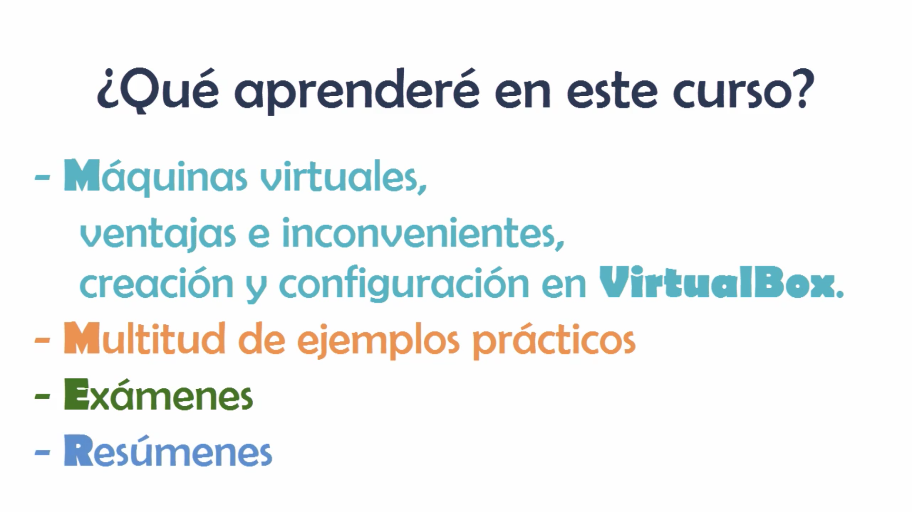

# 01 Presentación del curso 02:26 min

Bienvenido al curso de VirtualBox donde aprenderemos todo lo que debes saber sobre esta potente aplicación.

Ahora hablemos sobre los contenidos de este curso, vamosa ver que vas a aprender y a quien esta dirigido.

En este curso aprenderas lo qué es una máquina virtual, las ventajas e inconvenientes del uso de estas, así como a crearlas y configurarlas, todo ello enfocado al caso particular de VirtualBox como entorno de virtualización. 

Para hacerlo más didáctico el curso contará con infinidad de ejemplos prácticos, veremos cómo instalar las máquinas virtuales más comunes, aprenderemos a configurar las máquinas de forma de avanzada y veremos el caso práctico de un desarrollador que trabaje en Windows para entornos Linux, todo ello con muchos ejemplos y explicados de la mejor forma posible.

Además durante el curso contaremos con varios exámenes para poner a prueba nuestros conocimientos, así como resúmenes al final de cada sección a repasar los conceptos más importantes.

Al final del curso estarás capacitado sobradamente para crear y configurar tus propias máquinas de virtuales en VirtualBox, entendiendo su funcionamiento y configuraciones más avanzadas.

Este curso de VirtualBox está dirigido a todos aquellos alumnos que quieran aprender a crear y gestionar sus propias máquinas virtuales con este software. Para realizarlo no es necesario que el alumno tenga unos conocimientos técnicos específicos ya que se explicarán todos los conceptos de un nivel inicial sencillo evolucionando hasta llegar a un nivel avanzado de manejo de la aplicación, basta con que el alumno tenga conocimiento básico del sistema operativo habitual con el que trabaja, a nivel de ficheros, saber instalar programas, etc. y sobre todo que tenga ganas de aprender y hasta aquí la presentación de este curso de VirtualBox espero de todo corazón que este curso supere tus espectativas y sea de su completo agrado.

