# Sección 2: Conociendo VirtualBox 26 min

   * 02 VirtualBox y las máquinas virtuales 04:50 min
   * 03 Ventajas e inconvenientes de las máquinas virtuales 04:24 min
   * 04 Instalación de VirtualBox 06:16
   * 05 Nuestra primera máquina virtual 09:07
   * Preguntas sobre máquinas virtuales y VirtualBox 8 preguntas
   * Resumen 1 páginas

## 02 VirtualBox y las máquinas virtuales

Vamos a aprender lo que son las máquinas virtuales y sus características más importantes.

Así como una aplicación para gestionarlas de la que es objeto este curso VirtualBox que será nuestro software de virtualización para llevar toda esta teoría a la práctica, tanto esta clase como la siguiente son puramente teóricas pero fundamentales, te ruego que pongas mucha atención porque los conceptos que vamos a tratar ahora son fundamentales para adentrarnos con buen pie y empezar a comprender el mundo de la virtualización.

Lo primero y más básico sería preguntarnos qué es una máquina virtual.

Según la Wikipedia una máquina virtual se define como un software que simula una computadora y puede ejecutar programas como si fuese una computadora real o dicho de otra forma se trata de una aplicación que simula por software una computadora y que en la práctica tiene las mismas capacidades que una computadora real.

En adelante para referirnos a la máquina real y a la máquina virtual utilizaremos la nomenclatura **Anfitrión** y **Huésped** la máquina real o física toma el nombre de anfitrión, mientras que la máquina virtual toma el nombre de huésped, como ves los nombres les vienen al pelo.

Cuando ejecutamos una máquina virtual como es evidente esta máquina virtual o huésped tomará prestado sus recursos del anfitrión o máquina real.

Veámoslo con un ejemplo, pongamos que tenemos una máquina real con 4 gigas de memoria RAM, si ejecutamos en ella una máquina virtual y le asignamos un giga de ram esta última lo tomará prestado te los 4 gigas con los que cuenta la máquina real, la cual ya solo dispondrá de 3 GB para ejecutarse.

Pongamnos otro ejemplo, imaginemos que un usuario tiene un PC con Windows y este PC tiene un procesador de cuatro núcleos, 8 GB de memoria RAM y un giga de memoria gráfica, podemos definir una máquina virtual con Linux para que se ejecute dentro de Windows asignándole un núcleo del procesador, 2 gigas de ram 128MB de memoria de vídeo, como antes los recursos que toma el huésped ya no estarán disponibles para la máquina anfitrión. 

Evidentemente podemos ser más generosos con los recursos asignados a la máquina virtual pero siempre hay que tener en cuenta que los recursos que prestemos al huésped o máquina virtual quedarán a disposición de esta y no del sistema anfitrión es decir, en el ejemplo anterior Windows tendrá menos recursos del PC a su disposición, justo los que ha prestado a su huésped la máquina virtual con Linux.

Por otra parte el huésped máquina virtual no podrá nunca exceder la capacidad o recursos que le sean prestados por el anfitrión, en nuestro ejemplo anterior la máquina virtual con Linux tendrá unos límites de un núcleo del procesador, 2 gigas de memoria RAM y 128 MB de memoria de vídeo y nunca podrá por muchos recursos que le sobren anfitrión superar los que le han sido asignados en su configuración.

Otro punto a tener en cuenta es que si otorgamos un porcentaje elevado de recursos al huésped, corremos el riesgo de que la máquina Real o anfitrión quedé conlapzada ya que le será imposible correr holgadamente su propio sistema operativo qué es la base de todo sistema en ejecución.

Ya es hora de conocer al protagonista VirtualBox, VirtualBox es una aplicación desarrollada por la compañía Oracle para crear y gestionar máquinas virtuales. 

Disponible para sistemas operativos Windows, OSx, Linux y Solaris y es capaz de hospedar con seguridad múltitud de sistemas operativos diferentes. VirtualBox se distribuye de forma gratuita con una licencia OpenSource pero por otra parte el Extensión Pack que dota la aplicación de características adicionales como el soporte para USB, RDP, IPX aunque también se distribuye de forma gratuita no tienen licencia Open Source.

En una clase posterior descargaremos la aplicación y le instalaremos en nuestro equipo para poder trabajar con ella es importante tener claros los conceptos que hemos visto en esta clase, por ello en caso de ser necesario si no te ha quedado claro algo de lo que hemos visto aquí, no dudes en tomar de nuevo esta clase, cuántas veces sean necesarias y así afianzar esos conceptos clave que nos servirán para el resto del curso.

## 03 Ventajas e inconvenientes de las máquinas virtuales 04:24 min

Aunque el uso de máquinas virtuales puede parecer un escenario idílico.

En realidad tiene sus puntos a favor y sus puntos en contra conocer tanto unos como otros es lo que vamos a hacer en esta clase, como la anterior se trata de una clase de corte teórico pero fundamental, así que te pido un pequeño esfuerzo para comprender los conceptos que vamos a tratar en esta clase, que sean aplicables y habrá que tener en cuenta para el resto del curso.

Primero de todo que veamos cuáles son las características ventajosas del uso de máquinas virtuales.

Crear una máquina virtual es un proceso muy sencillo puede llevarnos tan solo unos pocos segundos, una reducción de tiempo que es abismal si la comparamos por ejemplo con el tiempo que nos llevaría montar un equipo real con hardware real.

El aislamiento implica que un fallo en una máquina virtual en ejecución no afecta para nada a otra u otras máquinas virtuales que podían estar ejecutándose en ese mismo momento.

Es decir si no máquina virtual se nos queda colgada, el resto de máquinas virtuales que podíamos tener en marcha en ese mismo momento seguirá funcionando como si no hubiera pasado nada.

Las máquinas virtuales tienen la capacidad de modificar sus propiedades y su configuración de forma muy sencilla, esta flexibilidad nos permite por ejemplo aumentar la memoria RAM asignada a una máquina virtual cuando tengamos necesidad de ello con la facilidad de solo cambiar un parámetro en su configuración.

Al tratarse de máquinas virtuales independientes cada una de ellas tiene sus propios usuarios, claves y métodos de acceso que igualmente son independientes.

Las máquinas virtuales suelen definirse en muy pocos ficheros, unos que visualizan los sistemas de almacenamiento como los discos duros y otros que contienen la configuración de esas máquinas, aseguran los datos o transportar los de un anfitrión a otro es tan sencillo como hacer copias de estos ficheros.

En nuestro caso que estamos dedicando este curso a VirtualBox en particular también existen un par de ventajas destacables de esta aplicación, la primera de ellas es que VirtualBox es un software que se distribuye de forma gratuita, es tan sencillo y barato cómo ir al sitio web oficial de VirtualBox, descargarnos la versión que corresponda a nuestro sistema operativo e instalarla y por cierto esto es lo que haremos en la siguiente clase. L aplicación VirtualBox está disponible para un buen número de sistemas operativos diferentes desde Windows, pasando por Mac OS X o Linux entre otros, ejemplos prácticos tanto podríamos ejecutar limos dentro de Windows como debes ejecutar Windows dentro de Linux y este es solo un ejemplo de los múltiples escenarios que podemos plantearnos.

Hasta aquí todo han sido ventajas, ahora veamos los inconvenientes que conlleva el uso de máquinas virtuales, la lista de desventajas que conlleva el uso de máquinas virtuales se reduce básicamente a un punto y no poco importante las máquinas virtuales consumen muchos recursos del anfitrión.

Un ejemplo si tenemos un PC con 4 gigas de memoria RAM y creamos una máquina virtual con 1,5 gb de ram. 

El sistema operativo anfitrión pasará a disponer de solo 2,5 GB de memoria RAM para sí mismo, con la bajada que eso supone en el rendimiento general del sistema, por eso debemos ser siempre cuidadosos con este punto y asignar recursos a nuestras máquinas virtuales en su justa medida, según las necesidades y según lo que nos permite el propio anfitrión.

Como hemos visto no todo es perfecto en el mundo de las máquinas virtuales tenemos puntos a favor pero también tenemos puntos en contra, lo importante de todo esto es conocer estos puntos y saber cuándo y en qué condiciones nos interesa utilizar una máquina virtual y de qué forma hacerlo, es decir saber configurar nuestra máquina virtual para que conmigo en armonía con su anfitrión y sobre todo no te asustes por tanta teoría la siguiente clase ya será de corte práctico empezando por la instalación de VirtualBox

# 04 Instalación de VirtualBox 06:16

[VirtualBox](https://www.virtualbox.org/)

[Installing Oracle VM VirtualBox and Extension Packs](https://www.virtualbox.org/manual/ch01.html#intro-installing)

Hasta ahora hemos estado viendo conceptos teóricos básicos en torno a las máquinas virtuales que son y qué ventajas e inconvenientes presentan.

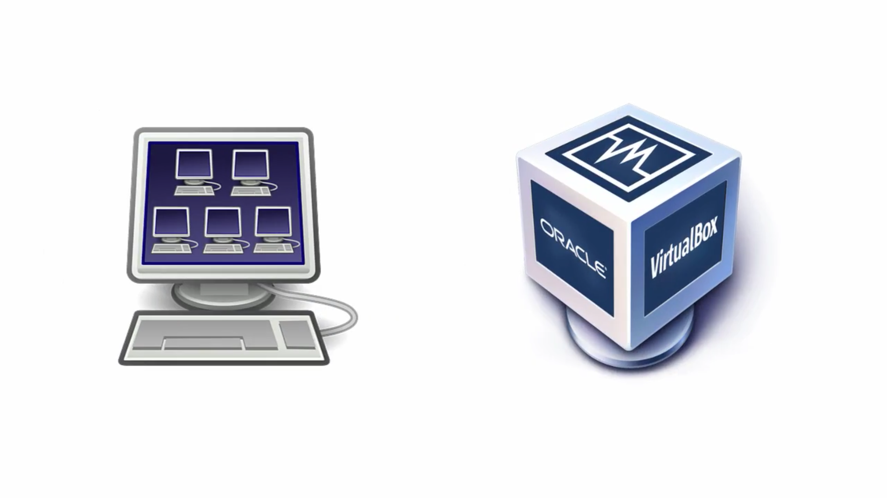

También hemos conocido de pasada al protagonista de este curso VirtualBox.

Pero es ahora en esta clase cuando vamos a conocerlo de primera mano, vamos a dedicarla por completo a la instalación de VirtualBox en nuestro equipo, para así poder empezar a trabajar con esta aplicación en clases posteriores. 

Para descargar VirtualBox abrimos una ventana del navegador y vamos a la dirección web [VirtualBox](https://www.virtualbox.org/) qué es el sitio web oficial de VirtualBox.

Una vez allí vamos a session download descargas y descargamos la última versión estable que en este caso en las 5.0.2 en mi caso voy a instalarme una máquina con Windows, entonces elijo está opción de aquí, como vemos es la misma versión tanto para 32 como para 64 bits, pinchamos aquí.

Y guardamos el archivo.

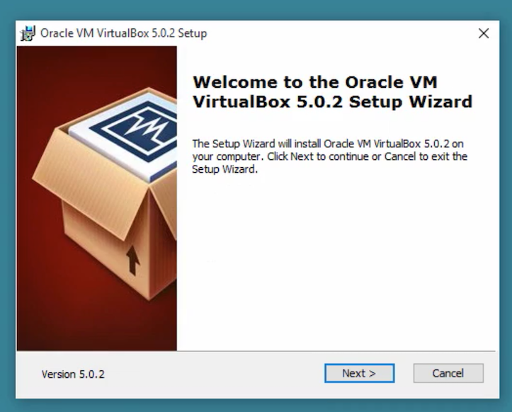

Una vez descargado el instalador lo ejecutamos y nos saldrá un wizar como este.

Le damos a siguiente y bueno aquí elegimos qué módulos queremos instalar por defecto vienen todos y así lo voy a dejar porque esté es la aplicación de Virtual Box, soporte para USB, soporte para redes, etc. en el destino dejaré el que viene por defecto, siguiente,

siguiente 

Y bueno aquí nos avisa que al instalar el soporte para redes, podemos ser desconectados temporalmente de la red, si queremos proceder le decimos que sí

e instalar 

y una vez instalada la aplicación la abrimos para echarle un primer vistazo

y aquí tenemos la pantalla principal de VirtualBox.

aquí a la izquierda en este recuadro en blanco aparecerán cada una de las máquinas que vayamos creando 

y a la derecha aparecerán las propiedades de esas máquinas.

Tenemos aquí un botón para crear una nueva máquina y diferentes opciones ayuda, opciones relacionadas con las máquinas 

Y aquí tenemos esta opción de preferencias qué es lo que vamos a ver ahora.

Vamos a ampliarlo un poco para verlo mejor.

En la pestaña General podemos cambiar lo que es la carpeta predeterminada para las máquinas virtuales, si tenemos por ejemplo un segundo disco duro con más espacio pues podemos indicar aquí una carpeta en ese segundo disco duro y dejar libre por ejemplo la unidad C. 

En la pestaña Entradas vemos los difentes atasjos en el teclado tanto en la aplicación como en la máquina virtual.

La opción de comprobar Actualizaciones cada X tiempo para que la aplicación comprueba a través de Internet si hay versiones nuevas y actualice o no.

El la pestaña Idioma me apuesto español porque es el idioma que tiene el sistema operativo por defecto entonces lo ha cogido también por defecto, aunque posteriormente ya ves que se puede cambiar.

En la pestaña Pantalla indicar un tamaño de pantalla máximo para lo que es el huésped si queremos que no sobrepase esa dimensiones en mi caso yo lo he dejado automático y tal y como viene porque me puede interesar cambiar ese tamaño en cualquier momento.

Opciones de red.

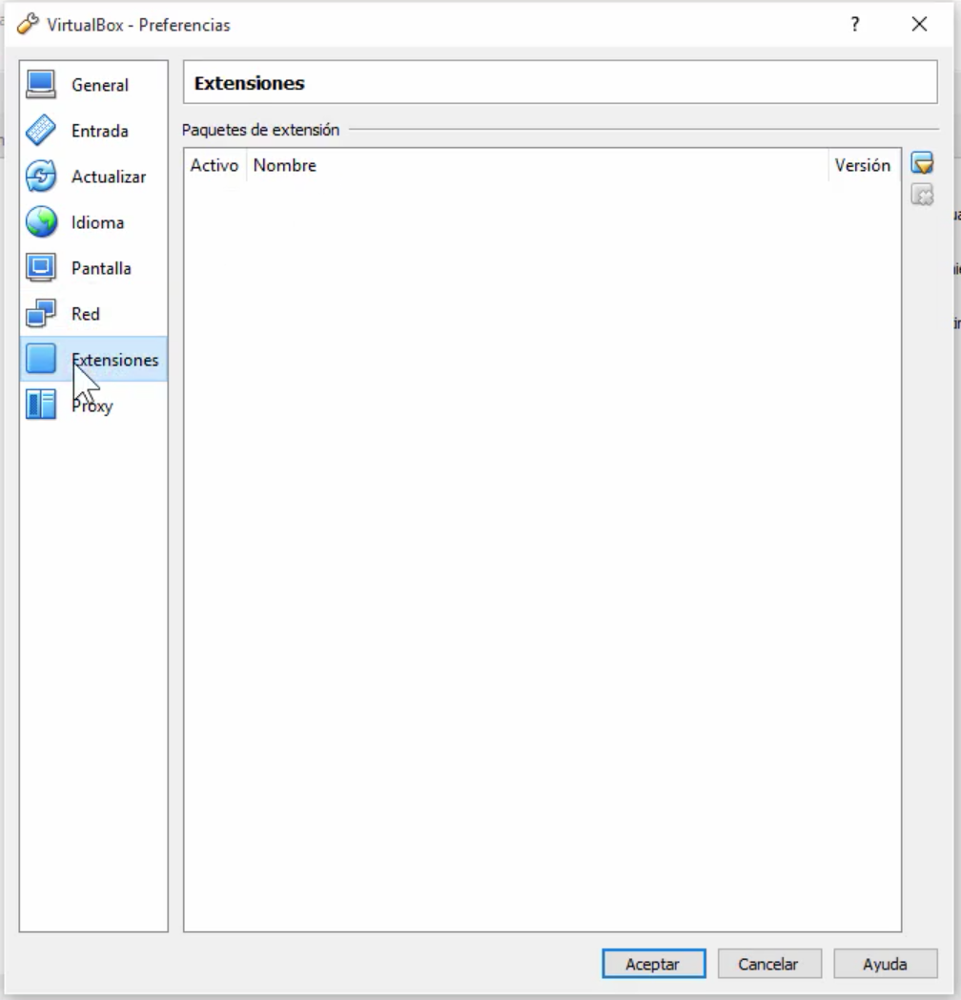

Extensiones son diferentes extensiones que podemos instalar a VirtualBox para darle mayor capacidad.

Y opciones de proxy si estamos conectados a Internet a través de un proxy pues lo haríamos aquí.

Una vez que hemos instalado VirtualBox una de las cosas necesarias que debemos instalar es el Extension Pack.

El Extension Pack se distribuye de forma gratuita a través de la página web oficial de Virtual Box y bueno no va a dar soporte para dispositivos USB 2.0, RDP y IPX entre otras cosas también que podéis ver dentro de la documentación oficial de la página web, son varias las cosas que nos proporciona y es muy muy recomendable instalarlo. Este Extension Pack se va a instalar dentro de las extensiones, hemos visto anteriormente que había una opción de la aplicación en VirtualBox para instalar extensiones. Esta Extension Pack es precisamente eso una extensión que se instala en la aplicación y qué nos da una serie de características adicionales. 

Como ves la versión del Extension Pack tiene que coincidir con la version de la aplicación, en este caso nos vamos a descargar la Extension Pack para VirtualBox 5.0.2 que es la misma versión que hemos instalado anteriormente. 

Entonces le damos aquí nos dice que está Extension Pack sirven para todas las plataformas es independiente del sistema operativo, del anfitrión.

Vamos aquí y le vamos a dejar que lo abra directamente con VirtualBox manager, es decir que lo abra la propia aplicación una vez descargado.

Una vez descargado nos lanza la pregunta, se abre directamente VirtualBox y nos lanza la pregunta queremos instalar Extension Pack le damos a instalar.

Y bueno nos viene aquí una licencia que debemos de leer y de aceptar.

Y con esto ya tendríamos instalado lo que es el Extension Pack para Virtual Box.

Vamos a comprobarlo nos vamos a Archivo - Preferencias - Extensiones y vemos que está instalado Oracle VM VirtualBox Extension Pack para versión 5.0.2 y con esto ya tenemos instalado VirtualBox en nuestro equipo.

Estamos preparados para la siguiente clase la cual dedicaremos a crear nuestra primera máquina virtual

### Instalacón en mi Ordenador Mac

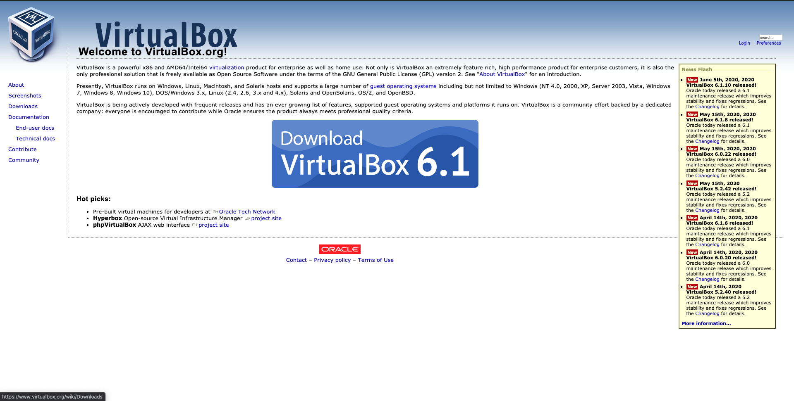

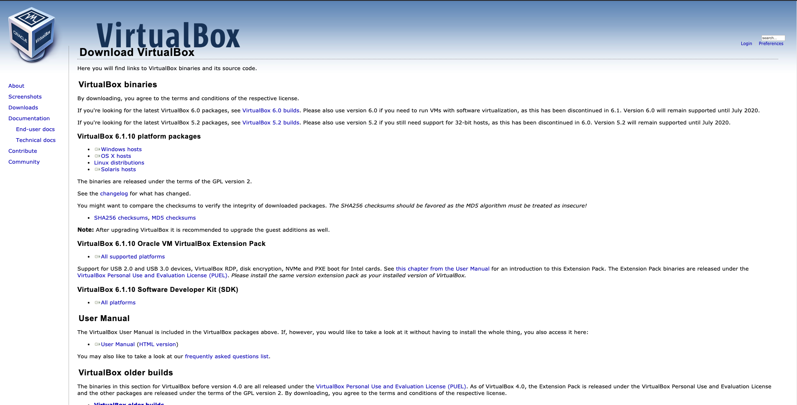

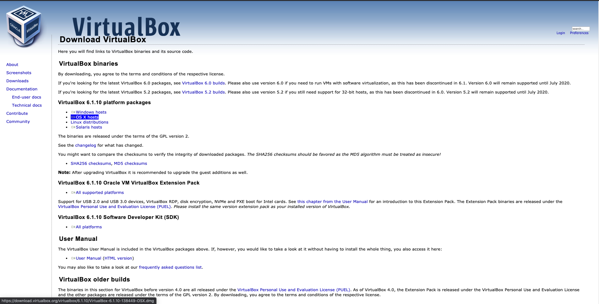

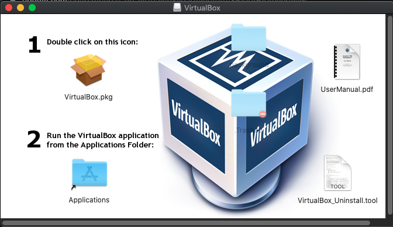

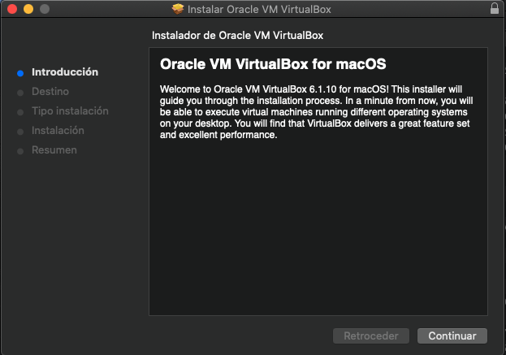

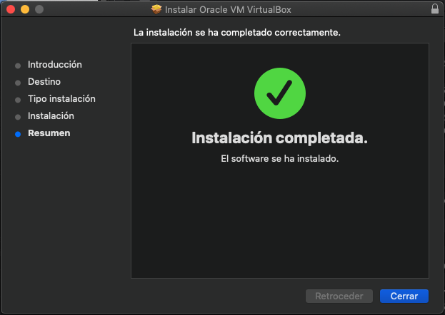

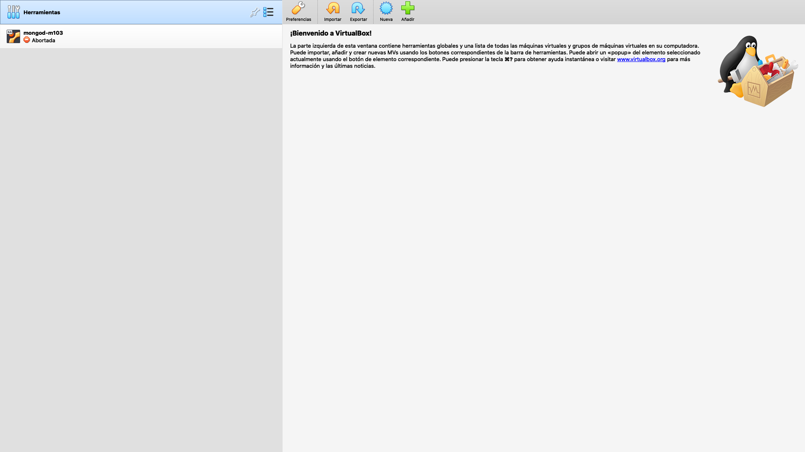

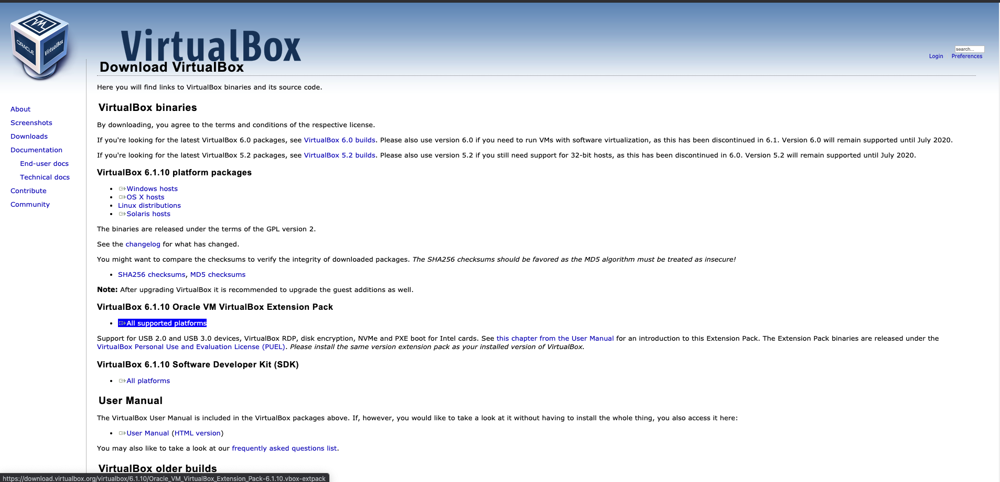

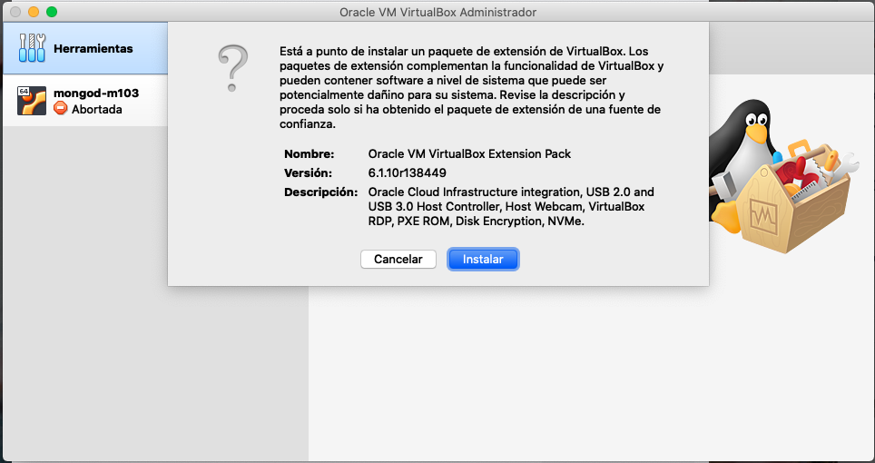

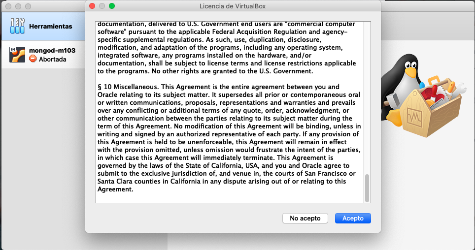

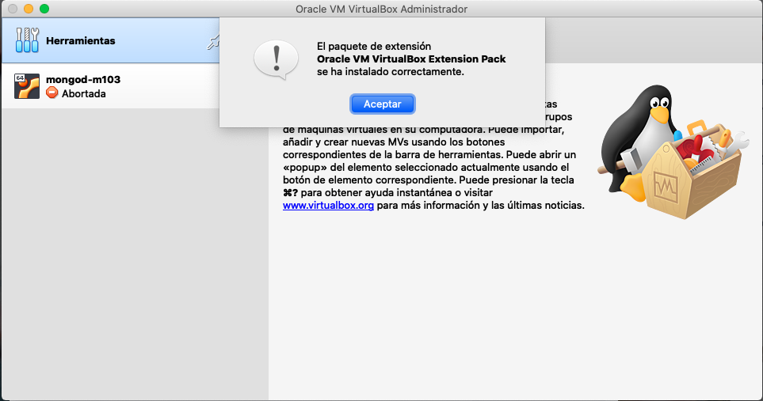

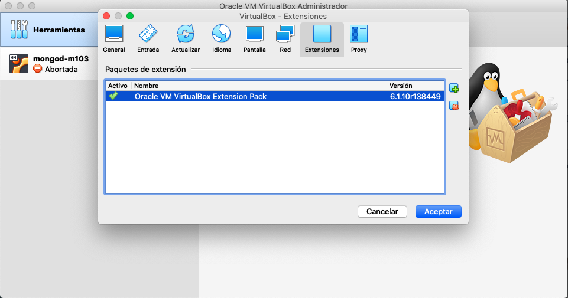

## 05 Nuestra primera máquina virtual 09:07

, ahora que ya tenemos VirtualBox instalado en nuestro equipo vamos a crear una máquina virtual sencilla Luis haremos ningún sistema operativo en esta máquina virtual eso lo haremos más adelante momento vamos a tomar un primer contacto con la aplicación ya ver las opciones más destacables en el proceso de creación de una máquina virtual para crear una nueva máquina virtual vamos a la aplicación y pinchamos en Nueva y nos sale una ventana donde tendremos que dar un nombre elegir el tipo etcétera aquí iremos paso a paso pero vamos a hacerlo directamente en el modo experto cuando nos salen todos los parámetros iniciales de golpe íbamos a ir rellenando los vamos a suponer que instalamos una máquina virtual con Linux Ubuntu vamos a darle el nombre puntúa la máquina equipo Linux y la versión baserna versión Ubuntu de 32 g luego el tamaño de la memoria debemos asignar un giga de ram 1024 MB y en disco duro vamos a crear un disco duro virtual ahora mismo un disco duro vacío hemos a crear y aquí no sarna ventana para que el disco duro virtual seréis cuenta directamente nos ha puesto como nombre del disco duro el mismo que el de la máquina virtual así también son más sencillos de localizada si sabemos que el disco duro que lleva el nombre Ubuntu pertenece la máquina Ubuntu aunque aquí podemos cambiar y poner otro si queremos pero bueno vamos a dejarlo así de momento hay que cenamos el tamaño vamos a poner un disco de 20 GB y el tipo de archivo que va a definir el disco duro tenemos varias opciones y hemos dejado en Vd y qué es el genérico de VirtualBox y respecto a esta última opción que sería el tipo de disco duro pues tenemos dos opciones una es reservar espacio de forma dinámica y otra o a tamaño fijo la diferencia está en que reservado dinámicamente si el disco duro el número definido con un tope máximo de 20 gigas inicialmente ocupará el mínimo posible y según vayamos ocupando datos y metiendo datos en este disco duro virtual pues irá ocupando cada vez más un giga los gigas 3 gigas hasta llegar a 20 gigas que será el tope del disco para la máquina virtual realmente se trata un disco de 20 GB pero para el anfitrión pues es un disco que en principio puede ocupar mucho menos en función de lo que tengamos ocupado y la otra opción sería tamaño fijo que definiría ahora mismo pues el fichero VHDL y directamente lo llenaría o dejaría un disco duro vacío de 20 gigas entonces realmente nos interesa más el tema de reservar espacio dinámicamente porque ocupar menos espacio inicialmente una vez que hemos creado a la máquina virtual ahora vamos a ver un poco las opciones que en torno a esta máquina se descuenta aquí en la parte izquierda de la aplicación nos indica la máquina que hemos creado que hemos dado el nombre de Ubuntu y aquí a la derecha las diferentes opciones o configuraciones que tiene definidas ahora mismo tiene las configuraciones que se han aplicado por defecto pero estos podemos modificarlas a nuestro gusto de cada una de estas opciones aquí nos demos trando que configuración tienen pero nosotros pensar acceder a ellas directamente por ejemplo a las opciones de pantalla y desde aquí podríamos modificar la configuración de pantalla que le damos a la máquina virtual o cualquiera de las otras configuraciones y hay otra forma también de hacerlo qué es una fiesta seleccionado la máquina virtual le damos aquí a configuración y nos aparecen todas tanto una forma como otras sirven igual está entonces desde aquí directamente dónde podemos ver también de un vistazo la configuración en general porque vienen aparte de poder hacer desaparecer los datos o bueno o se puede hacer de aquí de plástico no abrimos la configuración Imanol más ampliarlo un poco para verlo mejor íbamos a ir viendo pestaña por pestaña aquí por ejemplo en la pestaña General vemos el nombre que le hemos dado la máquina y el tipo que es un punto de 32 bits o aquí tienes opciones de para el portapapeles de arrastrar y soltar una descripción características de cifrado y aquí por ejemplo podemos ver la memoria base que le dimos un giga de RAM el orden de arranque por ejemplo arrancaría primero a partir de un disquete luego te lo miras ópticas en Ferrol y luego del disco duro aquí por ejemplo podemos desactivar relación de disquetes y vamos a poner un disquete o bien si ya tenemos sistema operativo instalado pues podemos dejarla así por ejemplo y que arranque directamente desde disco duro opciones Marta sociales en principio vamos a ver muy someramente por encima porque bueno ventas posteriores ya las veremos con más detenimiento ahora en la función sería un poco ver las opciones que hay dónde están y cómo acceder a ellas pero luego las veremos en maleta de aquí por ejemplo en el procesador pues vemos qué bueno yo estoy en una máquina que tiene ocho núcleos y podemos asignar por ejemplo o es recomendable pues nos indica que hasta aquí hasta lo verde sería no más de cuatro núcleos pero bueno podemos asignar los núcleos que queramos a la máquina un límite de ejecución etcétera también capacidad de aceleración igualmente memoria de vídeo estudias todo lo que tiene que ver con la parte gráfica de pantalla bueno se puede habilitar por ejemplo aceleración que es de aceleración de vídeos de pantalla remota captura de vídeo y todo lo que tiene que ver con las uñas de almacenamiento por ejemplo en por defecto nos queda dos controladoras una masacre a una controladora de tipo ida y una controladora SATA la controladora IDE no se ha colocado un CD-ROM que nos lo ha colgado como secundario maestro dentro del IDE podemos elegir un ejemplo si ponerlo como primario maestro-esclavo secundaria maestro esclavo ha puesto como secundaria maestro y en el SATA nos ha encantado saca no se ha conectado lo que es el disco duro que hemos creado quisierais cuenta por lo llevamos igual ubuntu.org que la extensión del tipo de disco y no la ha conectado virtualmente pues a un puerto SATA 0 cambiar las opciones incluso indicar si queremos que scientifique como una unidad de estado sólido etcétera Yamasaki opciones de audio de red podemos poner hasta 4 adaptadores de red por defecto nos habilita el primero una tarde red y bueno seguiremos diferentes tipos también opciones puertos serie por ejemplo podemos abrir los puertos serie por efecto no hay ningún habilitado USB aquí podemos habilitar USB de tipo 1. 1 2 y 3 y desde aquí pues lo que haríamos sería enlazar un dispositivo USB real que esté conectado nuestra máquina y anfitrión pues lo definiríamos incluiremos aquí en la lista y ese dispositivo ese es dejaría está disponible para anfitrión y estaría dedicado exclusivamente a la máquina acción de carpetas compartida que haremos el Matías eh posterior y opciones de la interfaz de usuario esto son estaba Rafa ejemplo se muestra en la parte superior de la máquina virtual y está en la parte inferior del equipo demos habilitar o deshabilitar para que se muestra o se muestre en pantalla completa etcétera y en principio bueno pues estás serían las opciones ya os digo vistas y un poco a grosso modo porque luego nos vamos a ver detenidamente más adelante y hasta aquí esta primera toma de contacto con VirtualBox no te preocupes si hay conceptos que ahora me visto de pasada ya que solo se trata de eso de una primera toma de contacto en caces posteriores veremos todas estas opciones de forma detallada

